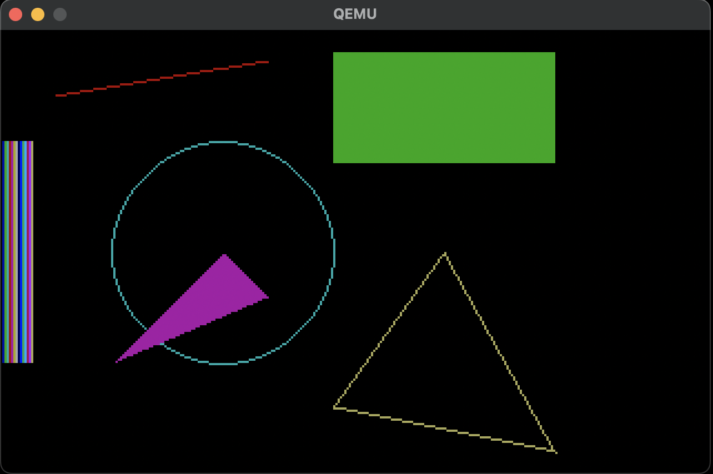

# PIXDRV 

A custom VGA driver compatible with x86 kernels, along with a simple graphics library (SGL) designed to provide basic drawing capabilities on VGA-compatible displays. The driver interfaces directly with VGA hardware, providing low-level access to manipulate the display buffer and control the screen output. The graphics library built on top of the driver offers functions for drawing basic shapes and handling colors.



## Features
+ Low-level VGA driver for interfacing with VGA-compatible displays.
+ Double buffering for reducing flickering and screen tearing.
+ Support for setting display modes, manipulating display buffer, and controlling screen output.
+ Simple graphics library built on top of the VGA driver.
+ Drawing functions for basic shapes (lines, rectangles, circles and triangles).
+ Support for handling colors and basic color manipulation.

## Prerequisites
- **Development Environment:** Set up a development environment with a compatible toolchain, such as NASM for assembly and GCC for C code.

Example Usage:
```c
#include "vga.h"
#include "sgl.h"

void main() {
    vgaInitGfxMode(MODE13H);

    sglClear();

    sglDrawRect(150, 10, 100, 50, GREEN);

    sglDrawLine(120, 14, 24, 30, RED);

    sglDrawCircle(100,100,50, CYAN);

    sglDrawFilledTri(100, 100, 50, 150, 120, 120, MAGENTA);

    sglDrawTri(200, 100, 150, 170, 250, 190, YELLOW);
    
    for (int i = 0; i < 15; i++) {
        for (int j = 0; j < 100; j++) {
            sglPutPixel(i, 50 + j, i);
        }
    }

    sglSwapBuffers();
}
```
## License

This project is licensed under the MIT License. See the LICENSE file for details.

## Credits

Developed by M. Sami Gürpınar
